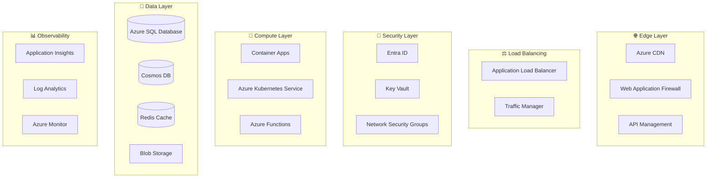

```mermaid
graph TB
    subgraph "🌐 Edge Layer"
        CDN[Azure CDN]
        WAF[Web Application Firewall]
        APIM[API Management]
    end
    
    subgraph "⚖️ Load Balancing"
        ALB[Application Load Balancer]
        TM[Traffic Manager]
    end
    
    subgraph "🔐 Security Layer"
        EID[Entra ID]
        KV[Key Vault]
        NSG[Network Security Groups]
    end
    
    subgraph "🚀 Compute Layer"
        ACA[Container Apps]
        AKS[Azure Kubernetes Service]
        AF[Azure Functions]
    end
    
    subgraph "💾 Data Layer"
        SQLDB[(Azure SQL Database)]
        COSMOS[(Cosmos DB)]
        REDIS[(Redis Cache)]
        BLOB[Blob Storage]
    end
    
    subgraph "📊 Observability"
        AI[Application Insights]
        LA[Log Analytics]
        MON[Azure Monitor]
    end
```