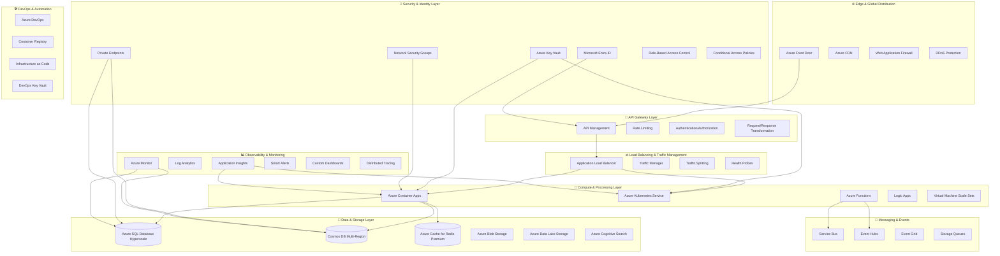

# 🏗️ Arquitetura Azure Enterprise - Resiliente e Escalável

## 🎯 Visão Arquitetural Estratégica

Esta arquitetura implementa os **três pilares fundamentais**:
- **Design for Failure**: Redundância e degradação graceful
- **Scale by Design**: Horizontal scaling e stateless architecture
- **Security by Default**: Zero Trust e Defense in Depth

## 🏛️ Diagrama de Arquitetura

## 🎯 Componentes Estratégicos

### **🌐 Edge & Global Distribution**
- **Azure Front Door**: Roteamento global inteligente com failover automático
- **Azure CDN**: Cache de borda para conteúdo estático e APIs
- **WAF**: Proteção contra OWASP Top 10 e ameaças emergentes
- **DDoS Protection**: Mitigação automática de ataques volumétricos

### **🔌 API Gateway Layer**
- **API Management**: Ponto único de entrada com versionamento e documentação
- **Rate Limiting**: Proteção contra abuse e garantia de SLA
- **Authentication/Authorization**: Integração com Entra ID e tokens JWT
- **Request/Response Transformation**: Adaptação de contratos sem mudança de código

### **🔐 Security & Identity**
- **Microsoft Entra ID**: Identity provider central com SSO
- **Azure Key Vault**: Gerenciamento centralizado de secrets e certificados
- **Private Endpoints**: Conectividade privada para serviços PaaS
- **RBAC**: Controle de acesso granular com princípio de menor privilégio
- **Conditional Access**: Políticas baseadas em contexto e risco

### **🚀 Compute & Processing**
- **Azure Container Apps**: Serverless containers com auto-scaling
- **Azure Kubernetes Service**: Orquestração avançada para workloads complexos
- **Azure Functions**: Event-driven computing para processamento assíncrono
- **Logic Apps**: Workflows de integração e automação

### **💾 Data & Storage**
- **Azure SQL Database Hyperscale**: OLTP com scaling independente de compute/storage
- **Cosmos DB Multi-Region**: NoSQL globalmente distribuído com consistency levels
- **Azure Cache for Redis Premium**: Cache distribuído com clustering
- **Azure Data Lake Storage**: Data lake para analytics e machine learning

### **📨 Messaging & Events**
- **Service Bus**: Messaging confiável com dead letter queues
- **Event Hubs**: Streaming de eventos em alta escala
- **Event Grid**: Event routing com filtering avançado

### **📊 Observability**
- **Application Insights**: APM com distributed tracing
- **Azure Monitor**: Métricas de infraestrutura e alertas inteligentes
- **Log Analytics**: Correlação de logs com KQL queries
- **Custom Dashboards**: Visibilidade para stakeholders de negócio

## 🛡️ Estratégias de Resiliência

### **Circuit Breaker Pattern**
- Implementação em todas as integrações externas
- Timeouts configuráveis baseados em SLAs
- Fallback mechanisms para funcionalidade essencial

### **Retry Strategies**
- Exponential backoff com jitter
- Retry policies diferenciadas por tipo de erro
- Dead letter queues para mensagens não processáveis

### **Health Monitoring**
- Health checks granulares por componente
- Dependency health incluído nas verificações
- Graceful shutdown com drain de conexões

## 📈 Escalabilidade Estratégica

### **Horizontal Scaling**
- Auto-scaling baseado em métricas de negócio
- Predictive scaling usando machine learning
- Multi-region deployment com traffic splitting

### **Performance Optimization**
- Caching layers estratégicos (L1, L2, CDN)
- Connection pooling otimizado
- Async processing para operações não críticas

## 🌍 Estratégia Multi-Region

### **Global Distribution**
- **Primary Region**: East US 2
- **Secondary Region**: West Europe
- **DR Region**: Southeast Asia

### **Failover Strategy**
- Automated failover com health-based routing
- RTO: < 5 minutos
- RPO: < 1 minuto
- Cross-region data replication otimizada

## 🎯 Métricas de Sucesso

| Métrica | Target | Ferramenta |
|---------|--------|-----------|
| **Availability** | 99.9% | Application Insights |
| **Response Time** | P95 < 200ms | Azure Monitor |
| **Error Rate** | < 0.1% | Log Analytics |
| **MTTR** | < 15min | Smart Alerts |
| **Throughput** | 10K+ RPS | Load Testing |
| **Cost Optimization** | 15% reduction YoY | Cost Management |

## 💰 Otimização de Custos

### **Cost Management**
- Reserved Instances para workloads previsíveis
- Spot Instances para processamento batch
- Auto-shutdown de recursos não-produtivos
- Resource tagging para chargeback/showback

### **Efficiency Optimization**
- Right-sizing contínuo baseado em utilização
- Storage tiering automático
- Network optimization para reduzir egress costs

---

## 🏆 Resultado Final

Esta arquitetura entrega **valor de negócio** através de:

✅ **Reliability**: 99.9% availability com failover automático  
✅ **Scalability**: 0-100 instâncias em < 2 minutos  
✅ **Security**: Zero Trust com compliance automática  
✅ **Performance**: P95 < 200ms com cache inteligente  
✅ **Cost-effectiveness**: 15% redução de custos YoY  
✅ **Observability**: Visibilidade completa com alertas proativos  

> 💡 **Uma plataforma enterprise-ready que suporta milhões de usuários com alta disponibilidade, segurança robusta e otimização contínua de custos.**