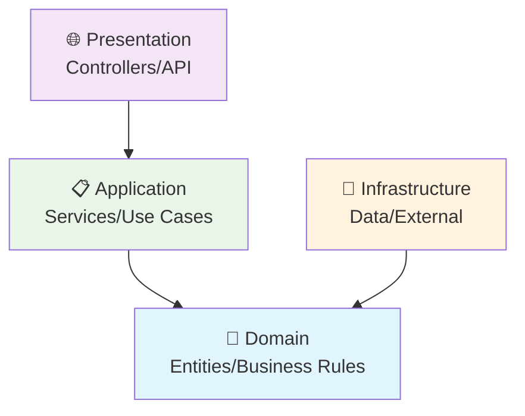

# 🏗️ ApiSample01 - Clean Architecture

## 📋 Visão Geral

Este projeto demonstra a implementação de uma API seguindo os princípios da **Clean Architecture**, com separação clara de responsabilidades e dependências apontando sempre para dentro.

## 🏛️ Arquitetura das Camadas



### 🌐 **Presentation Layer** (Controllers/API)
- ✅ Receber requisições HTTP
- ✅ Validar dados de entrada
- ✅ Serializar/Deserializar JSON
- ✅ Retornar códigos de status HTTP

### 📋 **Application Layer** (Services/Use Cases)
- ✅ Orquestrar fluxo de negócio
- ✅ Coordenar Domain e Infrastructure
- ✅ Implementar casos de uso
- ✅ Gerenciar transações

### 🎯 **Domain Layer** (Entities/Business Rules) - **NÚCLEO**
- ✅ Regras de negócio essenciais
- ✅ Entidades e Value Objects
- ✅ Domain Services
- ✅ Interfaces (contratos)
- ✅ Exceções de domínio

### 💾 **Infrastructure Layer** (Data/External)
- ✅ Acesso a banco de dados
- ✅ Chamadas para APIs externas
- ✅ Sistema de arquivos
- ✅ Implementação de interfaces do Domain

## 🎯 Regra de Ouro

> **Dependências sempre apontam PARA DENTRO:**

| Camada | Conhece |
|--------|----------|
| **Presentation** | Application + Domain |
| **Application** | Apenas Domain |
| **Domain** | Independente (não conhece ninguém) |
| **Infrastructure** | Apenas Domain |

## 🔄 Fluxo de Execução

```
Controller → Application Service → Domain Service
    ↓              ↓                    ↓
Recebe HTTP    Monta DTO           Regras de Negócio
Retorna DTO    Orquestra           Gera Entidades
```

## 📊 Responsabilidades

| Camada | Responsabilidade |
|--------|------------------|
| **Controller** | Apenas recebe/retorna HTTP |
| **Application** | Orquestra e monta DTOs de resposta |
| **Domain** | Regras de negócio puras |

## 🧪 Cobertura de Testes

| Projeto | Testes | Cobertura | Status |
|---------|--------|-----------|--------|
| **Domain** | 166 | 100.0% | ✅ Perfeito |
| **Application** | 24 | 100.0% | ✅ Perfeito |
| **Infrastructure** | 12 | 100.0% | ✅ Perfeito |
| **API** | 35 | 100.0% | ✅ Perfeito |
| **Total** | **237** | **100.0%** | 🏆 **Excelente** |

📊 [Ver relatório detalhado de cobertura](COVERAGE.md)

## 🚀 Como Executar

### Pré-requisitos
- .NET 9.0 SDK
- Visual Studio 2022 ou VS Code

### Executar a API
```bash
dotnet run --project ApiSample01.Api
```

### Executar Testes
```bash
# Todos os testes
dotnet test

# Com cobertura
./generate-coverage.sh
```

### Swagger UI
Após executar a API, acesse: `https://localhost:7000/swagger`

## 📁 Estrutura do Projeto

```
ApiSample01/
├── 🌐 ApiSample01.Api/              # Presentation Layer
├── 📋 ApiSample01.Application/       # Application Layer  
├── 🎯 ApiSample01.Domain/           # Domain Layer (Core)
├── 💾 ApiSample01.Infrastructure/   # Infrastructure Layer
├── 🧪 *.Tests/                     # Test Projects
└── 📊 CoverageReport/              # Coverage Reports
```

## 💡 Conceitos Implementados

- ✅ **Clean Architecture**
- ✅ **Domain-Driven Design (DDD)**
- ✅ **SOLID Principles**
- ✅ **Value Objects**
- ✅ **Repository Pattern**
- ✅ **Dependency Injection**
- ✅ **Custom Validation Attributes**
- ✅ **Exception Handling**
- ✅ **Unit Testing (100% Coverage)**

---

> 💡 **Dica**: A Application é o local ideal para transformar dados do Domain em DTOs para a API.

## 🏆 Avaliação Clean Architecture

Este projeto foi avaliado seguindo os princípios rigorosos da Clean Architecture e obteve **score perfeito**:

### 📊 Resultados por Camada
| Camada | Score | Status |
|--------|-------|--------|
| **Domain** | 100/100 | ✅ Perfeito |
| **Application** | 100/100 | ✅ Perfeito |
| **Infrastructure** | 100/100 | ✅ Perfeito |
| **Presentation** | 100/100 | ✅ Perfeito |
| **Dependencies** | 100/100 | ✅ Perfeito |

### 🎯 Principais Conquistas
- ✅ **Domain 100% Puro** - Zero dependências externas
- ✅ **Separation of Concerns** - Responsabilidades bem definidas
- ✅ **Dependency Inversion** - Interfaces no Domain
- ✅ **Value Objects** - Type safety e validação integrada
- ✅ **Repository Pattern** - Abstração de dados
- ✅ **Result Pattern** - Tratamento elegante de erros
- ✅ **Custom Validation** - Attributes usando regras do Domain
- ✅ **Exception Handling** - Filtros globais implementados

### 🏆 Score Final: **100/100** 🎉

> **Este é um modelo exemplar de Clean Architecture em .NET!**

📋 [Ver avaliação completa](AssessmentCleanArchitecture.md)
## 🗺️ Mapa de Interação

Este projeto segue um fluxo bem definido de interação entre as camadas da Clean Architecture:

### 🔄 Fluxo Principal
```
HTTP Request → Controller → Application Service → Domain → Infrastructure
     ↓              ↓              ↓            ↓           ↓
Valida Entrada → Orquestra → Aplica Regras → Gera Dados → Retorna JSON
```

### 📋 Componentes Principais
- **Controller**: `WeatherForecastApiController` - Recebe HTTP requests
- **Application**: `WeatherForecastApplicationService` - Orquestra casos de uso
- **Domain**: `WeatherForecast` Entity + Business Rules + Value Objects
- **Infrastructure**: `WeatherRepository` - Implementa acesso a dados

### 🎯 Regras de Dependência
```
Presentation → Application → Domain ← Infrastructure
```

### 📝 Exemplo de Fluxo
1. **HTTP GET** `/weather/api/v1/forecast` → Controller
2. **Validação** de `WeatherForecastRequest` (Days, Start, Limit)
3. **Orquestração** via Application Service
4. **Geração** de dados via Domain Service
5. **Conversão** Entity → DTO → JSON Response

🗺️ [Ver mapa completo de interação](Map.md)