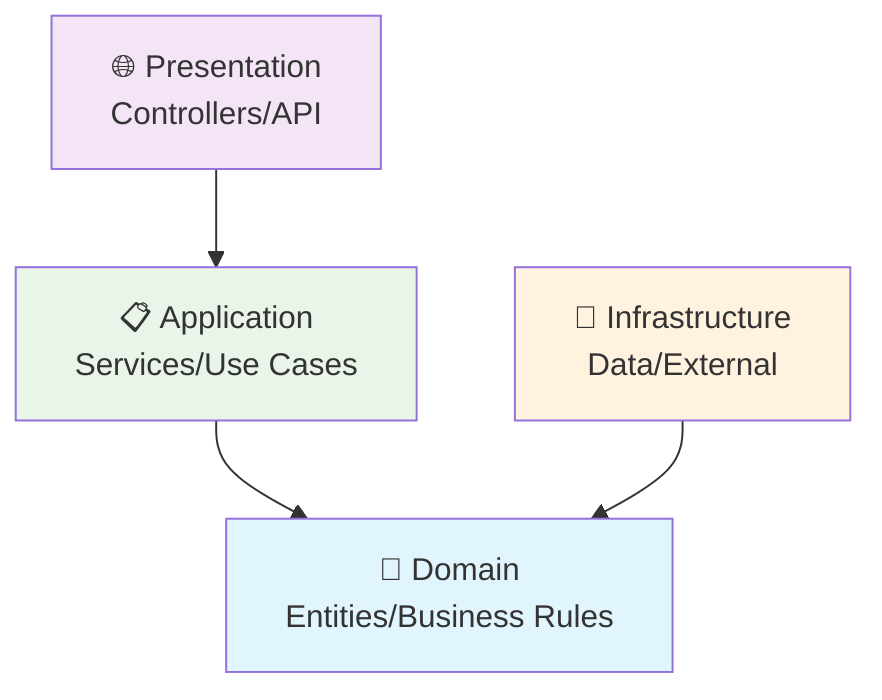

# 🌊 Fluxo Detalhado de Informação - WeatherForecast API

## 📋 Visão Geral do Projeto

Este projeto implementa uma **API de Previsão do Tempo** seguindo os princípios da **Clean Architecture**. A API permite consultar previsões meteorológicas com paginação, aplicando validações em múltiplas camadas e tratamento robusto de erros.

**Endpoint Principal:** `GET /weather/api/v1/forecast`

---

## 🔄 Fluxo Completo: Request → Response

### 1️⃣ **ENTRADA - HTTP REQUEST**

```http
GET /weather/api/v1/forecast?days=5&start=1&limit=10
Host: https://localhost:7299;http://localhost:5299
Accept: application/json
Swagger/OpenApi: https://localhost:7299/swagger
```

**Parâmetros de Query:**
- `days`: Número de dias de previsão (0-100)
- `start`: Página inicial (≥1) 
- `limit`: Itens por página (1-100)

---

### 2️⃣ **PRESENTATION LAYER - Controller**

#### 📁 Arquivo: `WeatherForecastApiController.cs`

```csharp
[HttpGet("forecast")]
public async Task<IActionResult> Get([FromQuery] WeatherForecastRequest request)
{
    var result = await _weatherForecastApplicationService.GetWeatherForecastApi(
        request.Days, request.Start, request.Limit);

    if (result.IsSuccess)
        return Ok(result.Success);

    return StatusCode(result.Error!.HttpCode, result.Error);
}
```

**Responsabilidades:**
1. **Recebe HTTP Request** e mapeia query parameters para `WeatherForecastRequest`
2. **Model Binding** automático do ASP.NET Core
3. **Validação de Entrada** via Custom Validation Attributes
4. **Chama Application Service** passando parâmetros primitivos
5. **Trata Result Pattern** - sucesso ou erro
6. **Retorna HTTP Response** com status code apropriado

#### 📁 Arquivo: `WeatherForecastRequest.cs`

```csharp
public class WeatherForecastRequest
{
    [DaysValidation]
    public int Days { get; set; } = 2;

    [StartValidation] 
    public int Start { get; set; } = 1;

    [LimitValidation]
    public int Limit { get; set; } = 100;
}
```

**Custom Validation Attributes:**
- `[DaysValidation]`: Valida range 0-100 usando regras do Domain
- `[StartValidation]`: Valida valor mínimo ≥1
- `[LimitValidation]`: Valida range 1-100

**Fluxo de Validação:**
1. ASP.NET Core executa Model Validation
2. Custom Attributes chamam `WeatherForecastBusinessRules`
3. Se inválido, lança `ET002FieldSizeError` com:
   - **HttpCode**: 400
   - **ErrorCode**: "ET:002"
   - **Message**: Detalhes do campo, valor e limite
4. `ModelValidationFilter` captura exceção
5. `ErrorResponseHelper` cria `ApiErrorResponse` padronizado
6. Retorna `400 Bad Request` com estrutura completa

---

### 3️⃣ **APPLICATION LAYER - Service**

#### 📁 Arquivo: `WeatherForecastApplicationService.cs`

```csharp
public async Task<Result<WeatherForecastApiResponseDto, ApiErrorResponse>> GetWeatherForecastApi(
    int days, int start, int limit)
{
    try
    {
        var request = new WeatherForecastApiRequestDto(days, start, limit);
        var forecastsData = await GetForecastsFromDomain(request.Days);
        var (forecasts, total) = forecastsData.PaginateWithTotal(request.Start, request.Limit);
        
        var page = new Page { Start = start, Limit = forecasts.Count(), Total = total };
        var transaction = TransactionHelper.CreateTransaction();

        var response = new WeatherForecastApiResponseDto
        {
            HttpCode = 200,
            HttpMessage = "OK", 
            Status = true,
            Data = forecasts,
            Page = page,
            Transaction = transaction
        };
        
        return Result.Ok(response);
    }
    catch (ET002FieldSizeError ex)
    {
        return Result.Fail<WeatherForecastApiResponseDto>(ErrorResponseHelper.CreateApiErrorResponse(ex));
    }
    catch (Exception ex)
    {
        return Result.Fail<WeatherForecastApiResponseDto>(ErrorResponseHelper.CreateApiErrorResponse(ex));
    }
}
```

**Responsabilidades:**
1. **Orquestra o Caso de Uso** completo
2. **Cria DTO de Request** interno para organização
3. **Chama Domain Repository** para obter dados
4. **Aplica Paginação** usando extension methods
5. **Monta Response DTO** com metadados (Page, Transaction)
6. **Trata Exceções** do Domain de forma elegante
7. **Retorna Result Pattern** encapsulando sucesso/erro

#### 📁 Método Auxiliar:

```csharp
private async Task<IEnumerable<WeatherForecast>> GetForecastsFromDomain(int days) => 
    await _weatherRepository.GetForecastsAsync(days);
```

**Paginação com Extension:**
```csharp
var (forecasts, total) = forecastsData.PaginateWithTotal(request.Start, request.Limit);
```

- **PaginateWithTotal**: Calcula skip/take e retorna dados + total
- **Skip**: `(start - 1) * limit`
- **Take**: `limit`

---

### 4️⃣ **DOMAIN LAYER - Núcleo do Negócio**

#### 📁 Arquivo: `IWeatherRepository.cs` (Interface)

```csharp
public interface IWeatherRepository
{
    Task<IEnumerable<WeatherForecast>> GetForecastsAsync(int days);
}
```

**Contrato do Domain:**
- Define **abstração** para acesso a dados
- **Não depende** de implementação específica
- **Assíncrono** para performance

#### 📁 Arquivo: `WeatherForecast.cs` (Entity)

```csharp
public class WeatherForecast
{
    public DateOnly Date { get; }
    public int TemperatureC { get; }
    public int TemperatureF { get; }
    public string? Summary { get; }

    public WeatherForecast(DateOnly date, int temperatureC, int temperatureF, string? summary)
    {
        Date = date;
        TemperatureC = temperatureC;
        TemperatureF = temperatureF;
        Summary = summary;
    }
}
```

**Características da Entity:**
- **Imutável** (apenas getters)
- **Construtor** garante estado válido
- **Sem dependências** externas
- **Representa** conceito de negócio puro

#### 📁 Arquivo: `WeatherForecastBusinessRules.cs`

```csharp
public static class WeatherForecastBusinessRules
{
    public const int MIN_DAYS = 0;
    public const int MAX_DAYS = 100;
    public const int MIN_START = 1;
    public const int MIN_LIMIT = 1;
    public const int MAX_LIMIT = 100;
    
    public static void ValidateWeatherRequest(int days, int start, int limit)
    {
        ValidateDays(days);
        ValidateStart(start);
        ValidateLimit(limit);
    }
    
    public static void ValidateDays(int days)
    {
        if (days < MIN_DAYS || days > MAX_DAYS)
            throw new ET002FieldSizeError("days", days, "int", MAX_DAYS, ApplicationConstants.WEATHER_API_NAME);
    }
}
```

**Regras de Negócio Centralizadas:**
- **Constantes** definem limites de negócio
- **Métodos estáticos** para validação
- **Exceções específicas** do Domain
- **Reutilizadas** em Presentation e Application

#### 📁 Arquivo: `WeatherForecastDomainService.cs`

```csharp
public static class WeatherForecastDomainService
{
    private static readonly string[] ValidSummaries = new[]
    {
        "Frio", "Quente", "Chuvoso", "Seco", "Úmido"
    };

    private const int MinTemperature = -20;
    private const int MaxTemperature = 40;

    public static WeatherForecast CreateRandomForecast(DateOnly date)
    {
        var temperature = Random.Shared.Next(MinTemperature, MaxTemperature);
        var summary = ValidSummaries[Random.Shared.Next(ValidSummaries.Length)];
        var temperatureF = 32 + (int)(temperature / 0.5556);

        return new WeatherForecast(date, temperature, temperatureF, summary);
    }

    public static IEnumerable<WeatherForecast> GenerateForecasts(int days)
    {
        return Enumerable.Range(0, days)
            .Select(index => CreateRandomForecast(
                DateOnly.FromDateTime(DateTime.Now.AddDays(index))
            ));
    }
}
```

**Lógica de Domínio:**
- **Gera dados simulados** seguindo regras de negócio
- **Conversão Celsius → Fahrenheit** com fórmula correta
- **Summaries válidos** definidos no Domain
- **Range de temperaturas** realistas (-20°C a 40°C)

---

### 5️⃣ **INFRASTRUCTURE LAYER - Implementação**

#### 📁 Arquivo: `WeatherRepository.cs`

```csharp
public class WeatherRepository : IWeatherRepository
{
    public Task<IEnumerable<WeatherForecast>> GetForecastsAsync(int days)
    {
        var forecasts = WeatherForecastDomainService.GenerateForecasts(days);
        return Task.FromResult(forecasts);
    }
}
```

**Responsabilidades:**
1. **Implementa** interface do Domain
2. **Delega** para Domain Service a geração de dados
3. **Simula** operação assíncrona
4. **Isola** detalhes de implementação

**Nota:** Em cenário real, acessaria banco de dados, APIs externas, etc.

---

### 6️⃣ **SAÍDA - HTTP RESPONSE**

#### Estrutura do Response:

```json
{
  "httpCode": 200,
  "httpMessage": "OK",
  "status": true,
  "data": [
    {
      "date": "2024-01-15",
      "temperatureC": 22,
      "temperatureF": 72,
      "summary": "Quente"
    },
    {
      "date": "2024-01-16", 
      "temperatureC": 18,
      "temperatureF": 64,
      "summary": "Úmido"
    }
  ],
  "page": {
    "start": 1,
    "limit": 2,
    "total": 5
  },
  "transaction": {
    "id": "550e8400-e29b-41d4-a716-446655440000",
    "timestamp": "2024-01-15T10:30:00Z"
  }
}
```

---

## 🔧 Componentes Auxiliares

### **Result Pattern**

```csharp
public class Result<TSuccess, TError>
{
    public bool IsSuccess { get; private set; }
    public TSuccess? Success { get; private set; }
    public TError? Error { get; private set; }
}
```

**Benefícios:**
- **Encapsula** resultado de operações
- **Evita** exceptions para fluxo de controle
- **Type-safe** handling de erros
- **Facilita** composição de operações

### **Pagination Extensions**

```csharp
public static (IEnumerable<T> data, int total) PaginateWithTotal<T>(
    this IEnumerable<T> source, int start, int limit)
{
    var total = source.Count();
    var skip = (start - 1) * limit;
    var data = source.Skip(skip).Take(limit);
    return (data, total);
}
```

### **Custom Validation Attributes**

```csharp
public class DaysValidationAttribute : ValidationAttribute
{
    public override bool IsValid(object? value)
    {
        if (value is int days)
        {
            try
            {
                WeatherForecastBusinessRules.ValidateDays(days);
                return true;
            }
            catch (ET002FieldSizeError)
            {
                return false;
            }
        }
        return false;
    }
}
```

---

## 🎯 Fluxo de Dados Resumido

```
1. HTTP Request → WeatherForecastRequest (Model Binding)
2. Custom Validation → WeatherForecastBusinessRules
3. Controller → WeatherForecastApplicationService
4. Application → WeatherRepository (via IWeatherRepository)
5. Repository → WeatherForecastDomainService
6. Domain Service → WeatherForecast[] (Entities)
7. Application → PaginationExtensions
8. Application → WeatherForecastApiResponseDto
9. Controller → HTTP Response (JSON)
```

---

## 🛡️ Tratamento de Erros

### **Validation Errors (400) - ET002FieldSizeError**
```json
{
  "httpCode": 400,
  "httpMessage": "Bad Request",
  "status": false,
  "error": {
    "code": "ET:002",
    "message": "Field size exceeds expected upper or infer limit: Field [days], Value [150], Type: [int], MaxSize: [100]",
    "application": "WeatherForecastApi"
  },
  "transaction": {
    "localTransactionId": "550e8400-e29b-41d4-a716-446655440000",
    "localTransactionDate": "2024-01-15T10:30:00Z"
  }
}
```

### **Server Errors (500) - Erro Desconhecido**
```json
{
  "httpCode": 500,
  "httpMessage": "Internal Server Error",
  "status": false,
  "error": {
    "code": "EP:999",
    "message": "Erro Desconhecido",
    "application": "WeatherForecastApi"
  },
  "transaction": {
    "localTransactionId": "550e8400-e29b-41d4-a716-446655440001",
    "localTransactionDate": "2024-01-15T10:30:15Z"
  }
}
```

---

## 🏗️ Arquitetura e Dependências

### **Direção das Dependências:**
```
Presentation → Application → Domain ← Infrastructure
```

### **Injeção de Dependência:**
```csharp
// Program.cs
services.AddScoped<IWeatherRepository, WeatherRepository>();
services.AddScoped<IWeatherForecastApplicationService, WeatherForecastApplicationService>();
```

### **Princípios Aplicados:**
- ✅ **Single Responsibility** - Cada classe tem uma responsabilidade
- ✅ **Open/Closed** - Extensível via interfaces
- ✅ **Liskov Substitution** - Implementações substituíveis
- ✅ **Interface Segregation** - Interfaces específicas
- ✅ **Dependency Inversion** - Depende de abstrações

---

## 🎉 Conclusão

Este projeto demonstra uma implementação **exemplar** de Clean Architecture, com:

- **Separação clara** de responsabilidades
- **Fluxo unidirecional** de dependências
- **Validação em múltiplas camadas**
- **Tratamento robusto** de erros
- **Código testável** e manutenível
- **Performance** com async/await
- **Documentação** via OpenAPI/Swagger

O resultado é uma API **robusta**, **escalável** e **fácil de manter**!

# 🏗️ ApiSample01 - Clean Architecture


## 📋 Visão Geral

Este projeto demonstra a implementação de uma API seguindo os princípios da **Clean Architecture**, com separação clara de responsabilidades e dependências apontando sempre para dentro.

## 🏛️ Arquitetura das Camadas



### 🌐 **Presentation Layer** (Controllers/API)
- ✅ Receber requisições HTTP
- ✅ Validar dados de entrada
- ✅ Serializar/Deserializar JSON
- ✅ Retornar códigos de status HTTP

### 📋 **Application Layer** (Services/Use Cases)
- ✅ Orquestrar fluxo de negócio
- ✅ Coordenar Domain e Infrastructure
- ✅ Implementar casos de uso
- ✅ Gerenciar transações

### 🎯 **Domain Layer** (Entities/Business Rules) - **NÚCLEO**
- ✅ Regras de negócio essenciais
- ✅ Entidades e Value Objects
- ✅ Domain Services
- ✅ Interfaces (contratos)
- ✅ Exceções de domínio

### 💾 **Infrastructure Layer** (Data/External)
- ✅ Acesso a banco de dados
- ✅ Chamadas para APIs externas
- ✅ Sistema de arquivos
- ✅ Implementação de interfaces do Domain

## 🎯 Regra de Ouro

> **Dependências sempre apontam PARA DENTRO:**

| Camada | Conhece |
|--------|----------|
| **Presentation** | Application + Domain |
| **Application** | Apenas Domain |
| **Domain** | Independente (não conhece ninguém) |
| **Infrastructure** | Apenas Domain |

## 🔄 Fluxo de Execução

```
Controller → Application Service → Domain Service
    ↓              ↓                    ↓
Recebe HTTP    Monta DTO           Regras de Negócio
Retorna DTO    Orquestra           Gera Entidades
```

## 📊 Responsabilidades

| Camada | Responsabilidade |
|--------|------------------|
| **Controller** | Apenas recebe/retorna HTTP |
| **Application** | Orquestra e monta DTOs de resposta |
| **Domain** | Regras de negócio puras |

## 🧪 Cobertura de Testes

| Projeto | Testes | Cobertura | Status |
|---------|--------|-----------|--------|
| **Domain** | 166 | 100.0% | ✅ Perfeito |
| **Application** | 24 | 100.0% | ✅ Perfeito |
| **Infrastructure** | 12 | 100.0% | ✅ Perfeito |
| **API** | 35 | 100.0% | ✅ Perfeito |
| **Total** | **237** | **100.0%** | 🏆 **Excelente** |

📊 [Ver relatório detalhado de cobertura](COVERAGE.md)

## 🚀 Como Executar

### Pré-requisitos
- .NET 9.0 SDK
- Visual Studio 2022 ou VS Code

### Executar a API
```bash
dotnet run --project ApiSample01.Api
```

### Executar Testes
```bash
# Todos os testes
dotnet test

# Com cobertura
./generate-coverage.sh
```

### Swagger UI
Após executar a API, acesse: `https://localhost:7299/swagger`

## 📁 Estrutura do Projeto

```
ApiSample01/
├── 🌐 ApiSample01.Api/              # Presentation Layer
├── 📋 ApiSample01.Application/       # Application Layer  
├── 🎯 ApiSample01.Domain/           # Domain Layer (Core)
├── 💾 ApiSample01.Infrastructure/   # Infrastructure Layer
├── 🧪 *.Tests/                     # Test Projects
└── 📊 CoverageReport/              # Coverage Reports
```

## 💡 Conceitos Implementados

- ✅ **Clean Architecture**
- ✅ **Domain-Driven Design (DDD)**
- ✅ **SOLID Principles**
- ✅ **Value Objects**
- ✅ **Repository Pattern**
- ✅ **Dependency Injection**
- ✅ **Custom Validation Attributes**
- ✅ **Exception Handling**
- ✅ **Unit Testing (100% Coverage)**

---

> 💡 **Dica**: A Application é o local ideal para transformar dados do Domain em DTOs para a API.

## 🏆 Avaliação Clean Architecture

Este projeto foi avaliado seguindo os princípios rigorosos da Clean Architecture e obteve **score perfeito**:

### 📊 Resultados por Camada
| Camada | Score | Status |
|--------|-------|--------|
| **Domain** | 100/100 | ✅ Perfeito |
| **Application** | 100/100 | ✅ Perfeito |
| **Infrastructure** | 100/100 | ✅ Perfeito |
| **Presentation** | 100/100 | ✅ Perfeito |
| **Dependencies** | 100/100 | ✅ Perfeito |

### 🎯 Principais Conquistas
- ✅ **Domain 100% Puro** - Zero dependências externas
- ✅ **Separation of Concerns** - Responsabilidades bem definidas
- ✅ **Dependency Inversion** - Interfaces no Domain
- ✅ **Value Objects** - Type safety e validação integrada
- ✅ **Repository Pattern** - Abstração de dados
- ✅ **Result Pattern** - Tratamento elegante de erros
- ✅ **Custom Validation** - Attributes usando regras do Domain
- ✅ **Exception Handling** - Filtros globais implementados

### 🏆 Score Final: **100/100** 🎉

> **Este é um modelo exemplar de Clean Architecture em .NET!**

📋 [Ver avaliação completa](AssessmentCleanArchitecture.md)
## 🗺️ Mapa de Interação

Este projeto segue um fluxo bem definido de interação entre as camadas da Clean Architecture:

### 🔄 Fluxo Principal
```
HTTP Request → Controller → Application Service → Domain → Infrastructure
     ↓              ↓              ↓            ↓           ↓
Valida Entrada → Orquestra → Aplica Regras → Gera Dados → Retorna JSON
```

### 📋 Componentes Principais
- **Controller**: `WeatherForecastApiController` - Recebe HTTP requests
- **Application**: `WeatherForecastApplicationService` - Orquestra casos de uso
- **Domain**: `WeatherForecast` Entity + Business Rules + Value Objects
- **Infrastructure**: `WeatherRepository` - Implementa acesso a dados

### 🎯 Regras de Dependência
```
Presentation → Application → Domain ← Infrastructure
```

### 📝 Exemplo de Fluxo
1. **HTTP GET** `/weather/api/v1/forecast` → Controller
2. **Validação** de `WeatherForecastRequest` (Days, Start, Limit)
3. **Orquestração** via Application Service
4. **Geração** de dados via Domain Service
5. **Conversão** Entity → DTO → JSON Response

🗺️ [Ver mapa completo de interação](Map.md)